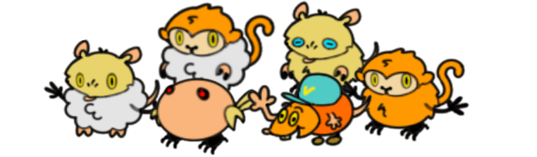

### Slow Summer Jam June 2023

### Theme: Idle, Mutation

### Summary:

[Play Here!](https://tooloo.itch.io/post-apocalyptic-creature-creator)

Mutata Jamboree is a very simple laid back game about the daily life of Artemis, a cute robot left to run a research lab after the demise of its human creators. Artemis is tasked with mixing up genetic information on various animals to create new creatures to inhabit the new post-apocalyptic world. 

Artemis is AI-controlled and will wander off to gaze. Once the player manages to get Artemis to open up the lab computer, the player can mix and match DNA vials to get all sorts of cute mutated creatures. 

